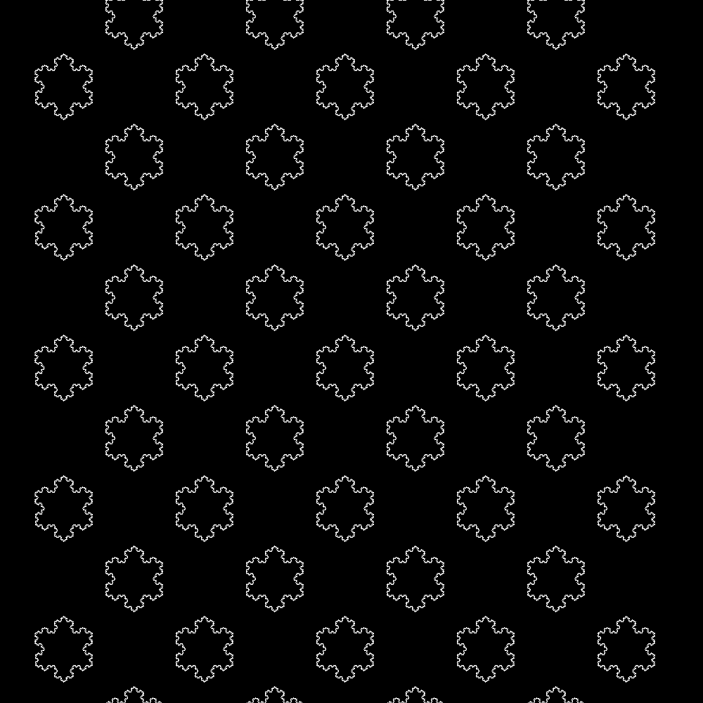

# 🎄 Advent of Code 2025 🎄
Happy holidays everyone! 

I'm back again with the Advent of Code challenge, but I'm officially done being a student and I started working. I can't guarantee I'll find the time to do them all the day they come out, but I'll try my best! 

My language of choice is Rust, mainly because I truly enjoy programming with it, and it's fun working on a “lower level” language. I might switch to Python if doing it in Rust would take too much time, but I don't plan to.

🏆 Goal: Get all 24 stars before the 31st of December! 🏆

## ⛄ How to run solutions ⛄
`cargo run -p day**` - Runs a specific day

`cargo run -p day** --release` - Runs a specific day with compiler optimizations

`cargo test -p day**` - Tests a specific day

`cargo test` - Tests all

## ❄️ How to use the "template" ❄️
I should really move it to another repo but whatever, this year I updated the template to Rust edition 2024!

1. Clone this repository
1. Install [cargo-generate](https://github.com/cargo-generate/cargo-generate): `cargo install cargo-generate`
1. Create file $CARGO_HOME/cargo-generate.toml with the following content: 
```toml
[favorites.aoc]
description = "Advent of Code Template"
vcs = "None"
path = "../template"
```
4. Go back to the repository, in the crates folder and run `cargo generate aoc --name day**`


## 🥛 Results 🍪
| Day | Part 1 Time | Part 1 Runtime[^1] | Part 2 Time | Part 2 Runtime[^1] |
|:-:|-:|-:|-:|-:|
|  1 | 02:40:26 |  87.0µs | 02:54:46 |  92.5µs |
|  2 | 02:14:52 |  84.9ms | 02:31:44 | 135.2ms |
|  3 | 14:19:14 | 141.4µs | 15:16:19 | 215.2µs |
<!--|  1 | 00:13:19 |  5740 |  19.5µs | 00:21:33 |  5187 |  20.7µs | -->

## 🎄 Have a wonderful Holiday Season everyone! 🎄




[^1]: `cargo run -p day** --release`, does not include the reading of the input file but includes parsing.
<!--[^2]: Some values are missing since I solved that days without using the usual device I use -->
